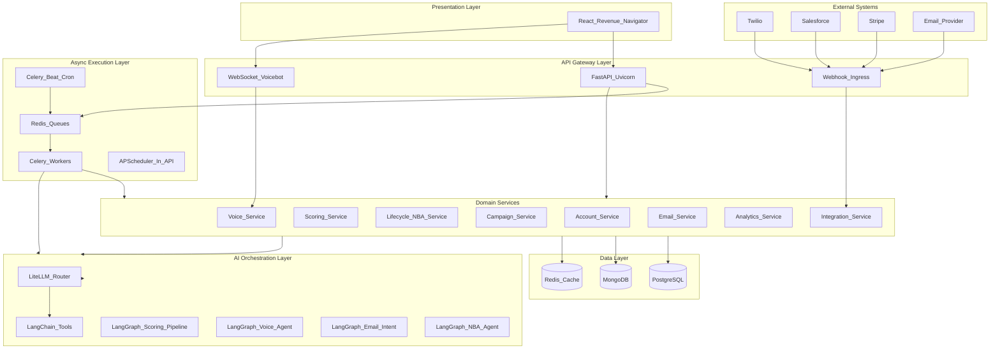
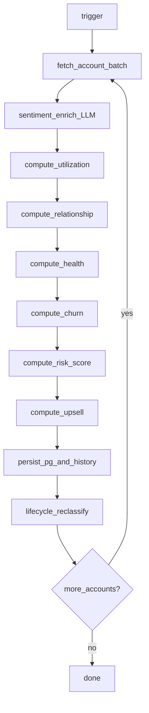
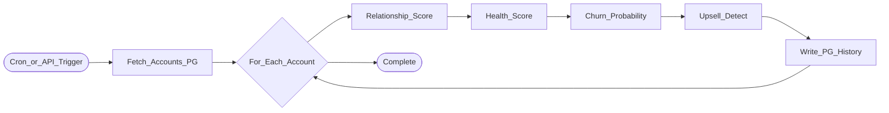
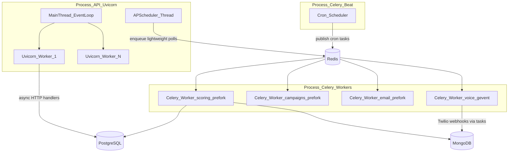
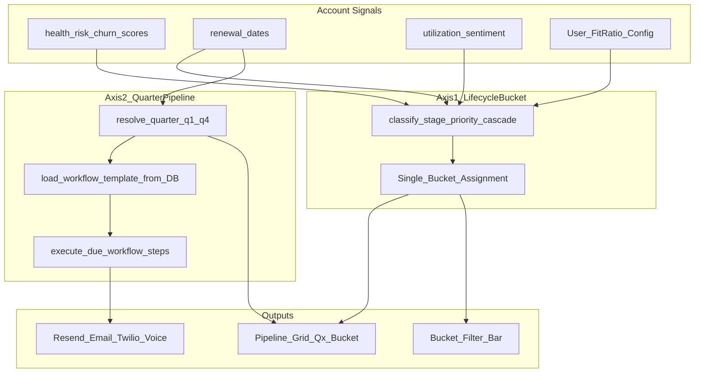
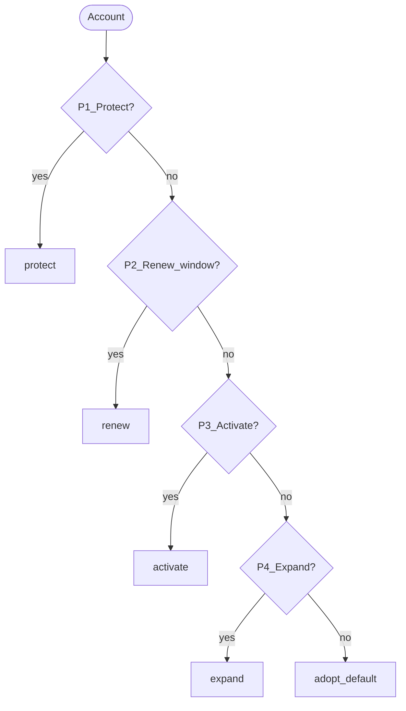
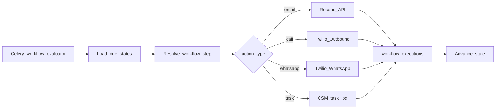

# Diagram Source Specifications

Mermaid source blocks for maintainability. Regenerate PNGs via `IMAGE_PROMPTS.md` when diagrams change.

## Platform Architecture

## Scoring Formula Pipeline (Phase 1)

Legend: `sentiment_enrich_LLM` = LiteLLM only; all other nodes = fixed formulas (Phase 1).

## LangGraph Scoring Pipeline (legacy summary)

## Async Runtime

## Dual-Axis Classification Model

## Lifecycle Bucket Priority Cascade

## Dynamic Workflow Executor

## PNG Target Files

| Mermaid / Concept | PNG File |
|-------------------|----------|
| Scoring Formula Pipeline | `images/rnu-scoring-formula-pipeline.png` |
| Platform Architecture | `images/rnu-tech-platform-architecture.png` |
| Data Flow | `images/rnu-tech-data-flow.png` |
| PostgreSQL ERD | `images/rnu-postgres-erd.png` |
| Mongo Collections | `images/rnu-mongo-collections.png` |
| Redis Topology | `images/rnu-redis-topology.png` |
| Async Runtime | `images/rnu-async-runtime.png` |
| Cron Scheduler | `images/rnu-cron-scheduler.png` |
| LangGraph Scoring | `images/rnu-langgraph-scoring.png` |
| LangGraph Voice | `images/rnu-langgraph-voice.png` |
| LangGraph Email | `images/rnu-langgraph-email-intent.png` |
| LangGraph NBA | `images/rnu-langgraph-nba.png` |
| Campaign Flow | `images/rnu-flow-campaign-tech.png` |
| Webhook Ingest | `images/rnu-flow-webhook-ingest.png` |
| Deployment | `images/rnu-deployment-topology.png` |
| Bucket Classification Cascade | `images/rnu-lifecycle-bucket-classification.png` |
| Bucket Filter Bar | `images/rnu-lifecycle-bucket-filter-bar.png` |
| Quarterly Pipeline Matrix | `images/rnu-quarterly-pipeline-matrix.png` |
| Dynamic Workflow Engine | `images/rnu-dynamic-workflow-engine.png` |
| Workflow Step Timeline | `images/rnu-workflow-step-timeline.png` |
| LangGraph Workflow Executor | `images/rnu-langgraph-workflow-executor.png` |
